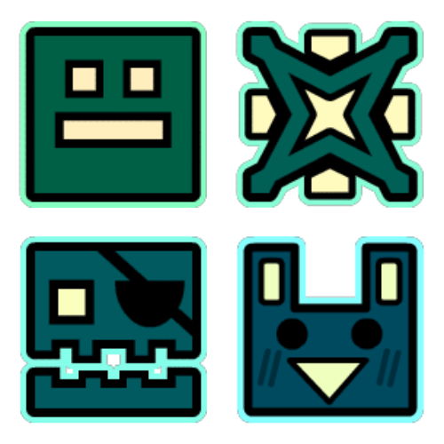

#  Colorful Icons

This mod is available on the [Geode index](https://geode-sdk.org/mods/ninkaz.colorful-icons) for Windows, Mac, iOS, and Android. After installing Geode, search for it in the in-game mod browser and click install.

This mod changes all icons (icon kit, shops, achievements, etc.) to use your player colors instead of the default gray. Locked icons also show more detail. You may recognize this mod as [Colored Icon Kit](https://github.com/sofabeddd/Colored-Icon-Kit) by sofabeddd, which was never updated past Geometry Dash 2.204.

## Build instructions

This mod can be built just like any other Geode mod. For more information, see the [geode docs](https://docs.geode-sdk.org/getting-started/cpp-stuff/).

```sh
# Assuming you have the Geode CLI set up already
geode build
```

Due to the `GJItemIcon::init` hook being really funky, this mod can't be built in debug mode—only release and release w/ debug info.
